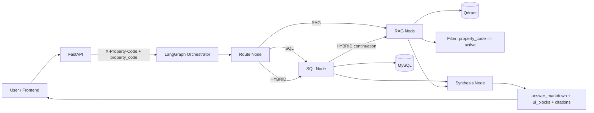

# Property-Scoped AI Platform

Backend for property-scoped property-management Q&A.

Every request is constrained to a single `property_code` (example: `115R`) across SQL and RAG paths.

## What This Service Does
- Ingests rent-roll spreadsheet snapshots into MySQL.
- Retrieves structured answers from deterministic SQL templates.
- Falls back to governed LLM-to-SQL when no deterministic template matches.
- Validates generated SQL before execution (allowlist + safety rules).
- Retrieves website content snippets from Qdrant with strict `property_code` filtering.
- Synthesizes responses as markdown + UI blocks + citations.

## Architecture
- API: FastAPI
- Structured store: MySQL
- Vector store: Qdrant
- Orchestration: LangGraph
- LLM providers: Google Gemini, OpenAI GPT, xAI Grok

Flow:
1. `route_node` chooses `SQL`, `RAG`, or `HYBRID`.
2. `sql_node` runs deterministic SQL templates first.
3. If no template matches, `sql_node` generates SQL with an LLM and validates/repairs it.
4. `rag_node` retrieves website chunks filtered by `property_code`.
5. `synth_node` returns safe user-facing output (without exposing SQL text).

## System Design Diagram


## Repository Layout
- `app/main.py`: API routes and scope enforcement
- `app/chat.py`: LangGraph orchestration (`route -> sql -> rag -> synth`)
- `app/sql_planner.py`: period parsing, unit parsing, SQL intent mapping
- `app/sql_guardrails.py`: SQL validator and response shaping
- `app/ingest.py`: spreadsheet-to-MySQL ingestion
- `sql/001_property_chatbot_schema.sql`: base schema
- `sql/002_property_web_sources.sql`: property website source mapping
- `sql/003_snapshot_uniqueness_migration.sql`: dedupe + enforce `(property_code, month_year)` uniqueness
- `tests/`: guardrail and planner tests

## Prerequisites
- Python 3.12+ (3.14 also works)
- Docker + Docker Compose (recommended for full stack)
- API keys as needed for selected model providers

## Environment Variables
Create a `.env` file from `.env.example` and fill values as needed.

Common variables:
- `DB_HOST`, `DB_PORT`, `DB_USER`, `DB_PASSWORD`, `DB_NAME`
- `QDRANT_URL`, `QDRANT_COLLECTION`
- `GOOGLE_API_KEY`, `OPENAI_API_KEY`, `XAI_API_KEY`
- `EMBEDDING_PROVIDER` (`google` or `ollama`)
- `GOOGLE_EMBEDDING_MODEL` or `OLLAMA_EMBED_MODEL`

## Local Setup
1. Install dependencies:
```bash
python -m pip install -r app/requirements.txt
```

2. Run tests:
```bash
pytest -q
```

3. Start API locally:
```bash
uvicorn app.main:app --host 0.0.0.0 --port 8000 --reload
```

## Docker Setup (Recommended)
Start all services:
```bash
docker compose up -d --build
```

Initialize schema (if needed):
```bash
docker exec -i property_mysql mysql -uroot -proot property_chatbot < sql/001_property_chatbot_schema.sql
```

Apply web source table schema:
```bash
docker exec -i property_mysql mysql -uroot -proot property_chatbot < sql/002_property_web_sources.sql
```

Apply snapshot uniqueness migration (for existing databases):
```bash
docker exec -i property_mysql mysql -uroot -proot property_chatbot < sql/003_snapshot_uniqueness_migration.sql
```

## Ingest Data
Run ingestion endpoint:
```bash
curl -X POST "http://localhost:8000/admin/ingest?mode=reload"
```

Modes:
- `skip_existing`: keep existing month snapshot if already present
- `reload`: replace month snapshot contents

## API Quick Checks
Health:
```bash
curl http://localhost:8000/health
```

Models:
```bash
curl http://localhost:8000/models
```

Chat:
```bash
curl -X POST http://localhost:8000/chat \
  -H "Content-Type: application/json" \
  -H "X-Property-Code: 115R" \
  -d '{"property_code":"115R","question":"Give me KPI summary and website highlights","model_id":"gemini-3.1-flash-lite"}'
```

Traces:
```bash
curl "http://localhost:8000/admin/traces?limit=50"
```

## Command Checklist (Copy/Paste)
Run these from the repository root for a clean end-to-end flow.

1. Start/rebuild services:
```bash
docker compose down
docker compose up -d --build
```

2. Apply schema and migrations:
```bash
docker exec -i property_mysql mysql -uroot -proot property_chatbot < sql/001_property_chatbot_schema.sql
docker exec -i property_mysql mysql -uroot -proot property_chatbot < sql/002_property_web_sources.sql
docker exec -i property_mysql mysql -uroot -proot property_chatbot < sql/003_snapshot_uniqueness_migration.sql
```

3. Ingest rent-roll files:
```bash
curl -X POST "http://localhost:8000/admin/ingest?mode=reload"
```

4. Verify service health and models:
```bash
curl http://localhost:8000/health
curl http://localhost:8000/models
```

5. Run a scoped chat request:
```bash
curl -X POST http://localhost:8000/chat \
  -H "Content-Type: application/json" \
  -H "X-Property-Code: 115R" \
  -d '{"property_code":"115R","question":"Show occupancy and top balances","model_id":"gemini-3.1-flash-lite"}'
```

6. View traces:
```bash
curl "http://localhost:8000/admin/traces?limit=50"
```

7. Follow logs (if needed):
```bash
docker compose logs -f
```

8. Stop services:
```bash
docker compose down
```

## Try These Example Questions
Use these with `property_code=115R` in `/chat` requests.

1. `show unit A103 sq ft May 2025`
2. `show unit A103 move in date May 2025`
3. `show unit A103 lease expiration date May 2025`
4. `show unit A103 balance May 2025`
5. `show leases expiring next month`

Additional useful examples:
- `show occupancy for May 2025`
- `show highest balances for May 2025`
- `show vacant units for May 2025`
- `show lease charges for unit A103 May 2025`
- `give me KPI summary and website highlights`

## SQL Safety Guardrails
Generated SQL is rejected unless all checks pass:
- `SELECT` only
- no DML/DDL (`INSERT`, `UPDATE`, `DELETE`, `DROP`, ...)
- no comments / no semicolon chaining
- no `SELECT *`
- allowlisted tables/columns only
- required bound `:property_code` filter on real table alias
- no hard-coded property codes
- `LIMIT` required for row queries (capped)

## Notes
- `property_code` scope mismatch between header and payload returns HTTP `403`.
- `/properties/{property_code}/kpis` is scoped to the latest snapshot month for that property.
- SQL provenance is returned in citations (`source_type=sql`, `query_source`, `sql_kind`, `row_count`).
