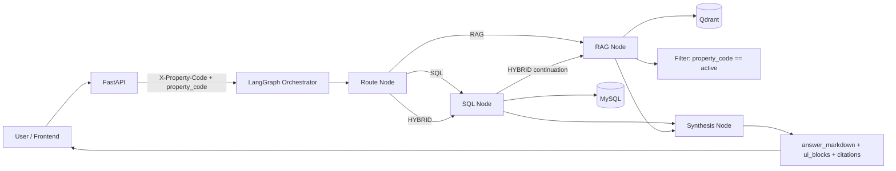

# Property-Scoped AI Platform

Backend for property-scoped Q&A where every request is constrained by `property_code` (example: `115R`).

## Architecture
- Structured data: **MySQL** (`properties`, `rent_roll_snapshots`, `rent_roll_units`, `rent_roll_unit_charges`)
- Unstructured data: **Qdrant** (`property_website_chunks`)
- Orchestration: **LangGraph** (`route -> sql -> rag -> synth`)
- LLM runtime switch: model registry (`/models`)
- Property guardrails: header/body scope check + SQL filter + Qdrant metadata filter

## System Design Diagram


## Features Implemented
- Idempotent ingestion modes:
  - `skip_existing` (default)
  - `reload`
- Period-aware SQL:
  - default latest month
  - month parsing (`May`, `YYYY-MM`)
  - all-months aggregate
- Operational SQL intents:
  - occupancy
  - vacant units
  - average rent (KPI)
  - leases expiring next month
- Website crawling pipeline (separate from MySQL rent tables)
- Real vector retrieval in Qdrant with strict `property_code` filter
- SQL provenance included in citations
- Backend observability traces (`/admin/traces`)
- Basic evaluation tests

## Prerequisites
- Docker + Docker Compose
- (Optional for local embeddings) Ollama

## Env
Use `.env` (already supported by `docker-compose`):

```env
GOOGLE_API_KEY=
XAI_API_KEY=
OPENAI_API_KEY=
ANTHROPIC_API_KEY=

EMBEDDING_PROVIDER=ollama
OLLAMA_BASE_URL=http://host.docker.internal:11434
OLLAMA_EMBED_MODEL=nomic-embed-text-v2-moe

GOOGLE_EMBEDDING_MODEL=models/gemini-embedding-001
```

## Start Services
```bash
cd /Users/abnikahilasamy/Personal_coding/Aker_project
docker compose up -d --build
```

## Ingest Structured Rent-Roll Data
```bash
curl -X POST "http://localhost:8000/admin/ingest?mode=skip_existing"
```

## Website Source Mapping
Apply web source table schema:
```bash
docker exec -i property_mysql mysql -uroot -proot property_chatbot < /Users/abnikahilasamy/Personal_coding/Aker_project/sql/002_property_web_sources.sql
```

Load property website mapping CSV:
```bash
docker cp /Users/abnikahilasamy/Personal_coding/Aker_project/property_sites.csv property_api:/tmp/property_sites.csv

docker exec -it property_api python /app/scripts/discover_property_sites.py \
  --csv /tmp/property_sites.csv \
  --host mysql --port 3306 --user root --password root --database property_chatbot
```

## Crawl + Index Website Chunks
```bash
docker exec -it property_api python /app/scripts/crawl_property_sites.py \
  --db-host mysql --db-port 3306 --db-user root --db-password root --db-name property_chatbot \
  --qdrant-url http://qdrant:6333 \
  --collection property_website_chunks \
  --max-depth 1 \
  --max-pages 5 \
  --reindex
```

## API Quick Tests
Health:
```bash
curl http://localhost:8000/health
```

Models:
```bash
curl http://localhost:8000/models
```

Chat (hybrid):
```bash
curl -X POST http://localhost:8000/chat \
  -H "Content-Type: application/json" \
  -H "X-Property-Code: 115R" \
  -d '{"property_code":"115R","question":"Give me KPI summary and website highlights","model_id":"gemini-3.1-flash-lite"}'
```

Chunk preview UI endpoint:
```bash
curl "http://localhost:8000/admin/chunks?property_code=115R&limit=20"
```

Observability traces endpoint:
```bash
curl "http://localhost:8000/admin/traces?limit=50"
```

## Evaluation (Basic)
Run tests in container:
```bash
docker cp /Users/abnikahilasamy/Personal_coding/Aker_project/tests property_api:/app/tests
docker exec -it property_api python -m pytest /app/tests -q
```

## Notes
- Keep `.env`, raw XLS files, and local mapping CSV out of Git.
- RAG quality depends on crawl quality and embedding coverage.
