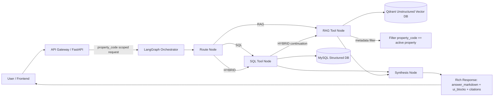

# Property-Scoped AI Platform (Docker + Pandas)

## What changed
- Switched ingestion to **Pandas** (`openpyxl` engine).
- Added **Docker Compose** stack for MySQL + API.
- Kept strict property scoping in API (`X-Property-Code` must match route property).
- Added rich response payload shape (`answer_markdown` + `ui_blocks`).

## Files
- `/docker-compose.yml`
- `/docker/Dockerfile.api`
- `/app/main.py`
- `/app/ingest.py`
- `/app/db.py`
- `/app/requirements.txt`
- `/sql/001_property_chatbot_schema.sql`

## Run everything
From `/Users/abnikahilasamy/Personal_coding/Aker_project`:

1. Start services:
```bash
docker compose up -d --build
```

2. Ingest all rent roll files:
```bash
curl -X POST http://localhost:8000/admin/ingest
```

3. Test property-scoped KPI call (`115R`):
```bash
curl -H "X-Property-Code: 115R" http://localhost:8000/properties/115R/kpis
```

If header/code mismatch, API returns `403`.

## Stop
```bash
docker compose down
```

## Notes
- MySQL schema auto-runs on container init.
- Data folder is mounted read-only into API container at `/data`.
- This is the structured-data base; RAG ingestion/retrieval can be added next as another service with metadata filtering on `property_code`.

## New Endpoints (Agentic Router + Model Switch)

List available models:
```bash
curl http://localhost:8000/models
```

Chat (SQL-routed example):
```bash
curl -X POST http://localhost:8000/chat \
  -H "Content-Type: application/json" \
  -H "X-Property-Code: 115R" \
  -d '{"property_code":"115R","question":"What is total balance and avg market rent?","model_id":"gpt-4.1-mini"}'
```

Chat (HYBRID-routed example):
```bash
curl -X POST http://localhost:8000/chat \
  -H "Content-Type: application/json" \
  -H "X-Property-Code: 115R" \
  -d '{"property_code":"115R","question":"Give me lease and website highlights for this property","model_id":"gpt-4.1"}'
```

Notes:
- Property scoping is enforced by comparing header `X-Property-Code` with payload `property_code`.
- RAG retrieval is currently a placeholder; SQL path is active.

## Idempotent Ingest Modes

Default (`skip_existing`):
```bash
curl -X POST "http://localhost:8000/admin/ingest?mode=skip_existing"
```

Force reprocess existing snapshots (`reload`):
```bash
curl -X POST "http://localhost:8000/admin/ingest?mode=reload"
```

## Qdrant + LangChain Notes

- Qdrant runs as separate service/container (`property_qdrant`).
- Unstructured data store remains separate from MySQL.
- Chat now uses LangChain model adapters:
  - Google Gemini (`gemini-*`) via `GOOGLE_API_KEY`
  - Grok (`grok-beta`) via `XAI_API_KEY`
  - OpenAI/Anthropic kept in registry for future use.

Set env keys using `.env`:
```bash
cp .env.example .env
# edit .env with your real keys
```

Rebuild after dependency changes:
```bash
docker compose up -d --build
```

## System Design Diagram



## Graph + RAG Test

Rebuild:
```bash
docker compose up -d --build
```

Chat using LangGraph flow:
```bash
curl -X POST http://localhost:8000/chat \
  -H "Content-Type: application/json" \
  -H "X-Property-Code: 115R" \
  -d '{"property_code":"115R","question":"Give me KPI summary and website highlights","model_id":"gemini-3.1-flash-lite"}'
```

Notes:
- Route node picks SQL/RAG/HYBRID.
- RAG retrieval now performs a Qdrant query with payload filter `property_code=<active_property_code>`.
- If graph/LLM fails, API returns deterministic fallback response.
