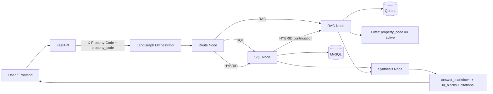

# Property-Scoped AI Platform

Backend for property-scoped Q&A where every request is constrained by `property_code` (example: `115R`).

## Architecture
- Structured data: **MySQL** (`properties`, `rent_roll_snapshots`, `rent_roll_units`, `rent_roll_unit_charges`)
- Unstructured data: **Qdrant** (`property_website_chunks`)
- Orchestration: **LangGraph** (`route -> sql -> rag -> synth`)
- LLM runtime switch: model registry (`/models`)
- Property guardrails: header/body scope check + SQL property filters + Qdrant metadata filters

## SQL Path (Current)
The structured SQL path is now **hybrid**:
1. Deterministic SQL templates for common intents
2. Governed LLM-to-SQL fallback for flexible structured questions
3. SQL validation + repair loop before execution

### Deterministic SQL Intents
- KPI summary
- Occupancy
- Vacant units
- Highest balances / delinquency
- Unit detail lookup
- Unit scalar field lookup (`unit_sq_ft`, `move_in_date`, `lease_expiration_date`, `market_rent`, `balance`)
- Rent by unit
- Deposits
- Lease charges
- Leases expiring in a specific month
- Leases expiring next month

### Month Logic
- Default: latest snapshot month for the active property
- Supports explicit month (`YYYY-MM`, e.g. `2025-05`)
- Supports month names (e.g. `May 2025`, `May`)
- Uses all months only when user explicitly asks (`all months`, `trend`, etc.)

### SQL Guardrails
Generated SQL is rejected unless all checks pass:
- `SELECT` only
- No DML/DDL (`INSERT`, `UPDATE`, `DELETE`, `DROP`, `ALTER`, `TRUNCATE`, `CREATE`, `REPLACE`, `MERGE`)
- No comments or semicolon chaining
- No `SELECT *`
- Allowed tables/columns only
- Must include `:property_code` bound parameter
- No hard-coded property values
- No access to system schemas (`information_schema`, `mysql`)
- Must include `LIMIT` for row queries (capped)

### SQL Provenance
SQL responses include provenance in citations/debug metadata:
- `source_type=sql`
- `property_code`
- `period_applied`
- `query_source` (`template` or `llm_generated_validated`)
- `sql_kind`
- `row_count`

## RAG Path
Website scraping/RAG flow is unchanged:
- Crawl property websites
- Chunk and embed content
- Retrieve with strict `property_code` metadata filter

## System Design Diagram


## Prerequisites
- Docker + Docker Compose
- (Optional for local embeddings) Ollama

## Env
Use `.env` (already supported by `docker-compose`):

```env
GOOGLE_API_KEY=
XAI_API_KEY=
OPENAI_API_KEY=
ANTHROPIC_API_KEY=

EMBEDDING_PROVIDER=ollama
OLLAMA_BASE_URL=http://host.docker.internal:11434
OLLAMA_EMBED_MODEL=nomic-embed-text-v2-moe

GOOGLE_EMBEDDING_MODEL=models/gemini-embedding-001
```

## Start Services
```bash
cd /Users/abnikahilasamy/Personal_coding/Aker_project
docker compose up -d --build
```

## Ingest Structured Rent-Roll Data
```bash
curl -X POST "http://localhost:8000/admin/ingest?mode=reload"
```

## Website Source Mapping
Apply web source table schema:
```bash
docker exec -i property_mysql mysql -uroot -proot property_chatbot < /Users/abnikahilasamy/Personal_coding/Aker_project/sql/002_property_web_sources.sql
```

Load property website mapping CSV:
```bash
docker cp /Users/abnikahilasamy/Personal_coding/Aker_project/property_sites.csv property_api:/tmp/property_sites.csv

docker exec -it property_api python /app/scripts/discover_property_sites.py \
  --csv /tmp/property_sites.csv \
  --host mysql --port 3306 --user root --password root --database property_chatbot
```

## Crawl + Index Website Chunks
```bash
docker exec -it property_api python /app/scripts/crawl_property_sites.py \
  --db-host mysql --db-port 3306 --db-user root --db-password root --db-name property_chatbot \
  --qdrant-url http://qdrant:6333 \
  --collection property_website_chunks \
  --max-depth 1 \
  --max-pages 5 \
  --reindex
```

## API Quick Tests
Health:
```bash
curl http://localhost:8000/health
```

Models:
```bash
curl http://localhost:8000/models
```

Chat (hybrid):
```bash
curl -X POST http://localhost:8000/chat \
  -H "Content-Type: application/json" \
  -H "X-Property-Code: 115R" \
  -d '{"property_code":"115R","question":"Give me KPI summary and website highlights","model_id":"gemini-3.1-flash-lite"}'
```

Chat (SQL deterministic intent):
```bash
curl -X POST http://localhost:8000/chat \
  -H "Content-Type: application/json" \
  -H "X-Property-Code: 115R" \
  -d '{"property_code":"115R","question":"show leases expiring next month","model_id":"gemini-3.1-flash-lite"}'
```

Observability traces endpoint:
```bash
curl "http://localhost:8000/admin/traces?limit=50"
```

## Tests
Run selected SQL-path tests locally:
```bash
PYTHONPATH=. pytest -q tests/test_scope_and_period.py tests/test_sql_citation_shape.py tests/test_sql_guardrails.py
```

Run tests in container:
```bash
docker cp /Users/abnikahilasamy/Personal_coding/Aker_project/tests property_api:/app/tests
docker exec -it property_api python -m pytest /app/tests -q
```

## Notes
- Keep `.env`, raw XLS files, and local mapping CSV out of Git.
- RAG quality depends on crawl quality and embedding coverage.
- If full local test collection fails due missing optional libs (e.g. `qdrant_client`), run container tests instead.
