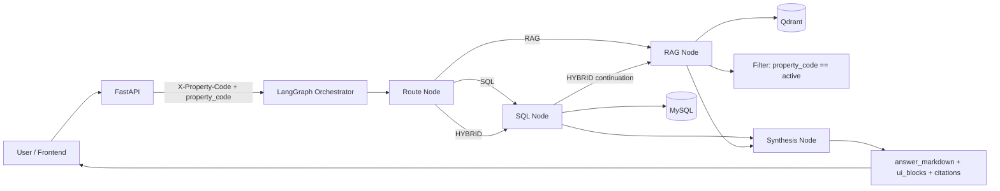

# Property-Scoped AI Platform (Architecture Overview)

## Goal
Provide property-scoped assistant responses where every request is constrained to one `property_code` (for example `115R`) across both structured SQL and unstructured retrieval paths.

## Current Architecture
1. API Layer (FastAPI)
- Enforces property scope via `X-Property-Code` header and request payload equality.
- Exposes operational endpoints (`/health`, `/models`, `/chat`, admin endpoints).

2. Orchestration Layer (LangGraph)
- Graph flow: `route_node -> sql_node -> rag_node -> synth_node` (branching by route).
- Routes requests to SQL, RAG, or HYBRID.

3. Structured Data Layer (MySQL)
- Tables:
  - `properties`
  - `rent_roll_snapshots`
  - `rent_roll_units`
  - `rent_roll_unit_charges`
- Snapshot uniqueness is enforced by `(property_code, month_year)`.

4. Unstructured Data Layer (Qdrant)
- Collection: `property_website_chunks`.
- Retrieval always applies metadata filter `property_code == active_property_code`.

5. Response Layer
- Returns:
  - `answer_markdown`
  - `ui_blocks` (KPI cards, tables, optional chart block)
  - `citations` (SQL provenance and/or RAG source references)
  - `debug` metadata

## System Design Diagram

## Property Scope Enforcement
1. API scope check:
- `X-Property-Code` must match request `property_code`; mismatch returns HTTP `403`.

2. SQL scope check:
- Deterministic SQL templates always include scoped property filters.
- Generated SQL must pass validation including bound `:property_code` on a real table alias.

3. RAG scope check:
- Qdrant query filter requires matching `property_code`.

## SQL Path Design (Hybrid)
The SQL path is intentionally hybrid:
1. Deterministic templates for common intents (KPI, occupancy, vacancies, highest balances, unit details/fields, deposits, charges, lease expirations).
2. Governed LLM-to-SQL fallback for flexible structured questions.
3. Validation + repair loop (up to 3 attempts) before execution.

### SQL Guardrails
Generated SQL is rejected unless all checks pass:
- `SELECT` only
- no DML/DDL keywords
- no comments or semicolon chaining
- no `SELECT *`
- allowlisted tables/columns only
- required bound `:property_code` filter
- no hard-coded property values
- no system schema access
- required `LIMIT` for row-returning queries (capped)

### SQL Provenance
SQL results add citation metadata:
- `source_type=sql`
- `property_code`
- `period_applied`
- `query_source` (`template`, `llm_generated_validated`, or `none`)
- `sql_kind`
- `row_count`

## RAG Path Design
- Embedding provider is configurable (`google` or `ollama`).
- Retrieved snippets are deduplicated and returned with source citation metadata.

## Model Runtime Support (Current)
The currently supported model prefixes in runtime are:
- `gemini*`
- `grok*`
- `gpt*`

Model options are exposed via `/models` from `MODEL_REGISTRY`.

## Ingestion Design
- Ingestion endpoint: `POST /admin/ingest?mode=skip_existing|reload`.
- Source files are parsed from the mounted data directory.
- `reload` replaces month snapshot unit/charge rows; `skip_existing` keeps already-loaded month snapshots.

## Operational Notes
- `/properties/{property_code}/kpis` is scoped to latest snapshot month for that property.
- Trace logging path is configurable by `TRACE_LOG_PATH` and defaults to `logs/traces.jsonl`.
- For existing databases created with old uniqueness rules, apply `sql/003_snapshot_uniqueness_migration.sql`.

## Known Limitations
- RAG answer quality depends on crawl/index quality and embedding coverage.
- End-to-end behavior depends on valid API keys and running MySQL/Qdrant services.
